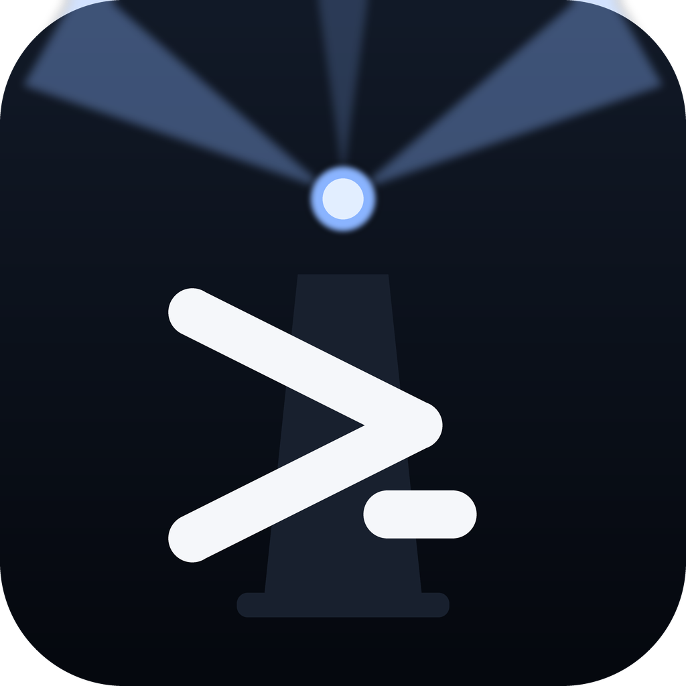

# Pharos — a terminal that stays cheap inside a VM

**A split-pane terminal emulator for Windows, in Dart/Flutter. The shape of
[Warp](https://warp.dev), but legibility-first, only the features the author actually uses, and
well-behaved under a software-emulated GPU.**

> Named for the Lighthouse of Alexandria — a beacon into the machine, and a nod to *staying light*,
> which is the whole reason it exists.

Warp's GPU-native renderer burns CPU when there is no real GPU underneath it — VMware SVGA 3D, Proxmox
virtio, and most remote desktops. Flutter on Windows renders through **ANGLE → Direct3D 11**, which
those environments *can* accelerate. That is the entire premise, and it held up: on the author's box
Pharos idles at **~0% CPU and ~75 MB**, against Warp's **~45% of a core** doing nothing.

This repository is where you get it. **The source is not here** — this is a download and a manual.

---

## What you get

**One file.** [The latest release](../../releases/latest) attaches `pharos.exe` on its own, and the
same exe in a zip if your browser objects to downloading an executable.

| file | what it is |
|---|---|
| `pharos.exe` | the whole application. 14.0 MB, and it needs nothing beside it |
| `pharos-0.14.1-windows-x64.zip` | the same exe, zipped, for browsers and mail gateways that block `.exe` |
| `SHA256SUMS.txt` | checksums for both, generated from the exact files attached |

### Exactly what this is

- **A native Windows 64-bit executable** (x86-64 / AMD64). Not a script, not an installer, not a
  self-extracting archive.
- **Genuinely one file.** A Flutter Windows build is normally an exe plus `flutter_windows.dll`, a
  `data\` folder holding the compiled code and assets, and four plugin DLLs — about 30 MB of loose
  files that must all sit beside each other. This exe has all of that packed **inside** it and mounts
  it as a virtual filesystem at run time, so it runs from an otherwise-empty folder. It was smoke
  tested that way on purpose: in an empty folder, which proves the packing rather than stray DLLs left
  over from a build.
- **Nothing is installed.** No registry keys, no services, no scheduled tasks, no start-up entries, no
  `PATH` change. Put the exe where you want it and run it.
- **No network access.** It contacts nothing: no telemetry, no update check, no licence call. There is
  exactly one socket in the product — a **loopback-only** control endpoint, described under
  [The control endpoint](#the-control-endpoint) below, and `--no-control` turns it off.
- **Built and tested on Windows 11 (x64).** Expected to work on Windows 10 x64; not tested, not
  claimed. There is no macOS build. A Linux build exists in the source tree but is not released here.

**Requirements:** 64-bit Windows, and that is all. Git for Windows is *optional* — install it and the
**Bash** shell option lights up and the git panel has something to read; without it Pharos falls back
to PowerShell and Command Prompt and simply shows no git panel.

If it refuses to start at all, the usual cause for any Flutter Windows application is a missing
**Microsoft Visual C++ 2015–2022 Redistributable (x64)**. Most machines already have one.

---

## Install

There isn't one. Put `pharos.exe` somewhere sensible and double-click it.

The author keeps it in `D:\tool`, next to everything else, because profile paths move per machine and
per user and Windows hides them. Anywhere you can find again is a good answer.

To upgrade, replace the exe. **Renaming a running exe is allowed on Windows** — the live instance keeps
its in-memory copy — so you do not have to close Pharos first; your *next* launch gets the new build.
Rename the old one aside rather than deleting it, and you have a rollback.

To uninstall: delete the exe, and delete `%APPDATA%\Pharos\pharos` if you also want the saved
layout gone. That is everything it ever wrote.

---

## Using it

One window. Panes split inside it, recursively, and every pane is identical — its own shell, its own
working directory, its own header and footer, its own filter.

### Panes

**Split** the focused pane with `Ctrl+Shift+D` (side by side) or `Ctrl+Shift+E` (stacked), and keep
splitting: the layout is a tree, so a pane can be split inside a pane inside a pane. Drag any divider
to re-balance. `Ctrl+Shift+W` closes the focused one.

**Move focus** with `Ctrl+Alt` and an arrow key — it goes to the pane in that direction, not to the
next one in some hidden order.

**Move the pane itself** with `Ctrl+Alt+Shift` and an arrow key. Same arrows, one more modifier: *go
to it* versus *take it there*. That is how the layout gets rearranged; there is no drag-and-drop of
panes.

The focused pane has a blue outline, and clicking a pane gives it the keyboard immediately.

### The keyboard

| chord | what it does |
|---|---|
| `Ctrl+Shift+P` | **Command palette** — search and run anything below, and see its chord |
| `Ctrl+Shift+D` | Split right |
| `Ctrl+Shift+E` | Split down |
| `Ctrl+Shift+W` | Close pane |
| `Ctrl+Alt+←↑→↓` | Focus the pane in that direction |
| `Ctrl+Alt+Shift+←↑→↓` | Move the focused pane in that direction |
| `Ctrl+Shift+C` | Copy the selection |
| `Ctrl+V` | Paste |
| `Ctrl+Shift+F` | Find in pane — filters the scrollback |
| `Ctrl+Shift+K` | Clear the pane |
| `Ctrl+B` | Show / hide the sidebar |
| `Ctrl+,` | Settings |

**Copy is `Ctrl+Shift+C` but paste is plain `Ctrl+V`,** and the asymmetry is deliberate: `Ctrl+C` has
to keep meaning *interrupt* in a terminal, and nothing useful is lost by leaving paste where every
other application on Windows puts it.

**Theme** (dark ↔ light) and **About** have no chord. Run them from the palette — that is what the
palette is for, and the palette shows every command's chord beside it, so it is where the keyboard gets
learned rather than memorised from a manual.

### Typing into it

Pharos **owns the input layer**. The `xterm` widget underneath runs read-only and every keystroke is
driven from a hardware key handler above it. That is not architecture for its own sake: it kills
Flutter's IME-composing bug, where refocusing a window leaves the terminal swallowing or duplicating
characters, and it gets editor-style type-over-selection, where typing with a selection active replaces
it.

The practical consequence you will notice: **typing in the Filter box is not interrupted by shell
output**, and pane chrome does not steal keystrokes.

### The sidebar

`Ctrl+B`, resizable, three modes:

- **Tabs** — every open pane in a list, to jump straight to one.
- **Files** — the focused pane's working directory.
- **Git** — a read-only view of the repository the focused pane is standing in: branch, ahead/behind,
  dirty state, changed files and their diffs, as a collapsible explorer tree with change-rollup badges
  on the folders.

**The git panel never writes.** No stage, no commit, no checkout, no stash. It is there so you can read
what changed without leaving the terminal; writes belong to a real git client.

The sidebar follows the **focused pane**, and the focused pane's directory is tracked live — so `cd` in
a pane and Files and Git follow it. PowerShell panes report their directory via `OSC 9;9` and `OSC 133`
marks; bash via `OSC 7`. A pane is seeded from the directory its shell actually started in rather than
replaying a path saved in a previous session, so a stale path cannot make the sidebar lie.

### Shells

`Ctrl+,` picks the shell for **new** panes: **Bash** (Git Bash — greyed out if Git for Windows is not
installed), **PowerShell**, or **Command Prompt**. Bash is the default when available. Existing panes
keep the shell they started with.

### It remembers

Close Pharos and reopen it and you get the same window in the same place, the same split layout, and
each pane back in its own working directory, with the theme you were using. Nothing to save and nothing
to configure — it is written as you go, to a small SQLite database.

### The bars

The top bar is **frameless** — Pharos draws its own slim chrome rather than wearing a native Windows
title bar. Each pane carries a footer with its working directory and git branch / ahead-behind / dirty
state, and the window has a one-line status bar along the bottom.

---

## Where it keeps things

Everything lives in **`%APPDATA%\Pharos\pharos`**, and nowhere else:

| | |
|---|---|
| `pharos.db` | the split layout, each pane's directory, the theme and the chosen shell. SQLite, relational — not a JSON blob |
| `window.json` | the window's size and position |
| `log\pharos.log` | a small diagnostics log — start-up, and anything that crashed |
| `control.handshake` | how local tooling finds the control endpoint. See below |

**Run only one Pharos at a time.** Every instance uses that same `pharos.db`, so two of them will
overwrite each other's saved layout on exit — last one out wins. This is not detected or prevented; it
is simply not a case that has been designed for.

If `pharos.db` is ever damaged, delete it. You lose the saved layout and nothing else.

---

## The control endpoint

Pharos opens a small **HTTP endpoint bound to `127.0.0.1` only**, on a port the OS picks, guarded by a
token regenerated each launch. `control.handshake` in the folder above records the port and that token,
which is how local tooling — the author's MCP bridge — finds it.

It exists so a tool on **your own machine** can ask the running app what its panes are and what is in
them, for automated verification. The token is not a secret from you; it is there so that *other
processes on your machine* cannot drive your terminal.

- `pharos.exe --no-control` — do not open it at all.
- `pharos.exe --control-port=<n>` — pin the port instead of letting the OS choose.

Those are the only two command-line arguments. If you have no use for the endpoint, `--no-control` and
the product has no socket in it whatsoever.

**A known wrinkle:** if a second instance starts and dies, it can leave `control.handshake` pointing at
its own dead process. Local tooling then fails to connect until the next ordinary launch of Pharos
rewrites the file. Deleting the file by hand is also safe.

---

## What this deliberately is not

Named so you do not go looking:

- **No AI features.** None. It is a terminal.
- **No command blocks.** Warp's signature feature, and the one most responsible for its cost.
- **No tabs, and no second window.** Splits are the whole navigation model, and the Tabs sidebar lists
  panes, not tabs.
- **No native title bar**, by choice.
- **No plugins, no themes beyond the two, no configuration file.** Two themes, three shells, and a
  settings dialog with two things in it.
- **No writes from the git panel.**

**Remote panes are not part of this release.** You will find a *New Remote Pane* entry in the palette
on `Ctrl+Shift+R`. It belongs to a separate, unfinished piece of work that needs server components that
are not published here, and **it has not been meaningfully tested**. Treat it as absent; use the local
terminal, which is what this download is.

---

## What has been tested

Stated so that "works on my machine" is at least a specific machine.

- **Built on** a Windows 11 x64 VM with Flutter/Dart 3.12.2, and **run and verified** on the author's
  Windows 11 x64 workstation. Both are the author's own machines.
- The **pure-Dart core is unit tested** — the pane tree with its focus, navigation and split ratios,
  the keymap, and the persistence layer are all headless-testable packages with their own suites, and
  the analyzer is clean before anything is committed.
- **Idle cost was measured, not assumed:** ~0% CPU, ~75 MB resident, against Warp at ~45% of a core on
  the same box.
- **This exe was smoke tested from an empty folder**, which is the test that proves the single-file
  packing rather than leftover build output.

**Be aware of the honest gap:** this build shipped on a clean analyzer plus the tests of the package
that changed, and the **full workspace suite has not been run since 11 August 2026**. It is a tested
fix on a tested codebase; it is not a fully regression-tested release, and it would be wrong to imply
otherwise.

## Known limits — read this bit

- **Windows x64 only.** No macOS build exists. A Linux build exists in the source tree and is not
  released here.
- **One instance at a time**, per the note on `pharos.db` above.
- **The git panel is read-only** and shows the repository of the focused pane only.
- **No configuration file.** If you want a keybinding changed, or a third theme, this is not currently
  the terminal for you — the keymap is data-driven internally, but there is no user override yet.
- **Remote panes are unfinished and untested** — see above.
- **Windows 10 is untested.**

---

## Version

**0.14.1**, built 1 September 2026. Its headline change is a fix for a recurring UI lockup — which, for
the record, was never a mystery in the code: the fix had been written weeks earlier and simply never
built, so every report after it was against a binary that predated the fix.

---

## Licence

**[MIT](LICENSE).** Use it, copy it, change it, ship it inside something you sell. The only conditions
are that the copyright line travels with it and that the warranty disclaimer comes too.

There is deliberately nothing here worth policing. The disclaimer is the part that earns its place, and
it cuts in your favour as much as mine: this is a terminal, it runs whatever you type into it, it is
not a safety net, and nobody is standing behind what a command you ran did to your files.

Pharos stands on other people's work, all under their own permissive licences — Flutter and Dart
(BSD-3-Clause), `xterm` and `flutter_pty` (MIT), SQLite (public domain). Nothing above affects those.

Linking to this repository is always welcome.
